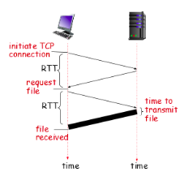

# LOG minggu 3 Jarkomdat

### Leonardo 1806191023
### Jarkomdat - A
---

Network applications communicating using network protocols & architectures.

Two type application communication architectures: 
1. **Client-Server** : Server selalu nyala dengan IP yang permanen dan menjadi data center dari aplikasi. sedangkan Client berkomunikasi dengan server (mengakses ke server). IP dari Client bisa berubah ubah dan tidak selalu menyala. komunikasi antar 2 client tidak secara langsung terhubung, karena keduanya sebenarnya hanya terhubung ke server yang menjembatani.
2. **Peer to peer (P2P)** : Server / client. tidak selalu menyala. Antar peer bertukar informasi saat koneksi dihubungkan (IP address, data, dll). koneksi dilakukan dari end-system ke end-system. 

**Sockets** Proses pengiriman dan penerimaan pesan/paket dalam networking dilakukan dengan *Socket*

Setiap IP address memiliki banyak port untuk aplikasi yang berbeda.

Faktor yang dibutuhkan dalam transport service:
1. data integrity , atau integritas data, data yang berintegritas tidak mentoleransi loss dalam pengirimannya tapi biasanya waktu lebih lama
2. Timing,  waktu transfer data yang efektif. jika ingin mementingkan kecepatan, maka data loss mungkin harus ditoleransi.
3. throughput, beberapa aplikasi punya throughput minimum untuk menjalankan dan berkomunikasi dengan baik. biasanya dalam aplikasi audio video call hal ini penting.
4. security, keamanan data menjadi hal yang penting dalam pengiriman informasi, terutama informasi yang sensitif.

Transport Protocol Service:
- TCP\
  Reliable, full of control, tidak provide timing yang cepat, tidak butuh throughput yg besar, 
- UDP\
  tidak reliable dan kurang control karena bisa terjadi data loss. 

### Web & HTTP
aplikasi web biasanya berjalan dengan Client-Server. HTTP menggunakan TCP di transport layernya dan biasanya / umumnya menggunakan port 80. 

ada dua macam HTTP, yaitu non-persistent, dan persistent

dalam non persistent HTTP Sebuah client harus menginisiasi koneksi ke server terlebih dahulu (hand-shake) kemudian baru bisa merequest file / data. 

jadi ada 2 kali round-trip-time (RTT) termasuk waktu mentransmisi file dalam waktu total mmelakukan non-persistent http request sampai direspons.
setelah data diterima, maka koneksi di close.
dan jika ingin request lagi harus di-open / inisiasi koneksi lagi.

dalam persisten HTTP koneksi yang diinisiasi tidak menutup kkoneksi / handshakenya  sehingga hanya ada sekali handshake atau inisiasi koneksi. data dapat dikirimkan kapan saja saat koneksi sudah diopen. contoh penggunaan persistent adalah dengan web-socket

dalam HTTP request ada beberapa method
- POST
- GET
- HEAD
- PUT
- PATCH
- DELETE

dalam HTTP response ada beberapa kode respons.
- 200 / (2xx), OK atau sukses
- 301 / (3xx), Moved permanently / redirected
- 400 / (4xx), Error bad request, dan error error lainnya
- 500 / (5xx), server eror, HTTP version not support,

