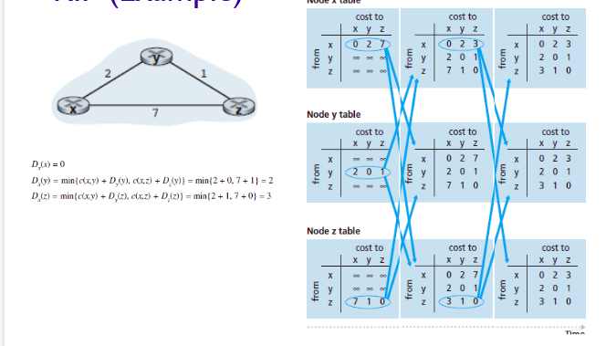

RIP OSPF

network layer punya 2 kerjaan yaitu forwarding dan routing.

- Intra-AS Routing, Routing yang dilakukan di dalam satu network yang sama, biasanya dalam satu ISP.
- Inter-AS Routing, Routing antar network atau ISP yang berbeda. 

ada 2 protokol yang umum ketika melakukan Routing Intra-AS:
- RIP (Routing Information Protocol)
- OSPF (Open Shortest Path First)

### RIP (Routing Information Protocol)
pada dasarnya setiap router terkoneksi dengan router lainnya secara langsung ataupun melalui router lain diantara router. pada awalnya setiap router hanya memiliki informasi mengenai router yang bertetanggan dengan dirinya (yang terhubung secara langsung). Nantinya setiap router akan melakukan exchange informasi beberapa kali antar dirinya dengan router lainnya, agar setiap router dapat memiliki informasi lebih dari sekedar path ke router tetangga namun juga dapat memiliki informasi tentang router yang bersebrangan termasuk cost untuk mencapai router tersebut. dapat diilustrasikan dengan tabel seperti dibawah dimana exchange informasi terjadi beberapa kali antar router.

### OSPF (Open Shortest Path First)
pada protokol OSPF dicari path tercepat untuk mencapai sebuah router dari router asal. Karena hubungan antar router dapat direpresentasikan dengan weighted graph dengan weight nya adalah cost untuk mengirim informasi antar router, maka masalah pencarian shortest path dapat dilakukan salah satunya dengan menggunakan *djikstra algorithm*. 

### InterAS Routing : BGP 
untuk melakukan routing Inter-AS, biasanya protokol yang digunakan umum adalah **BGP** (Border Gateway Protocol). Dengan BGP maka sebuah network/subnetwork dapat mengoneksikan dirinya dengan network lain dalam lingkup yang lebih besar (internet). Poin penting yang ada pada BGP adalah melakukan advertising network kepada network lain. Tidak semua router pada network dapat melakukan advertising ke network lainnya, hanya router-router yang menjadi gateway di AS tersebut saja. Dalam routing & forwarding nya nanti path yang diambil dapat dipilih sesuai, shortest path nya, NEXT-HOP terdekat (jalan tercepat mencapai AS lain), atau sesuai dengan policy ketentuan persetujuan antar AS.